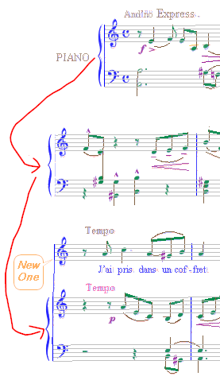
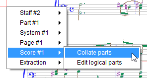
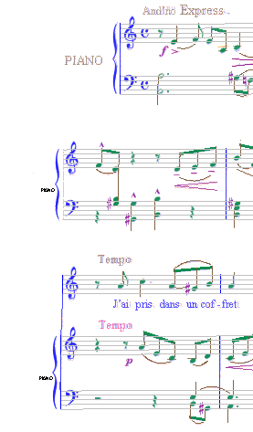
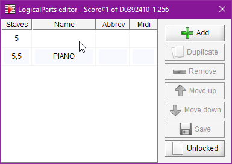
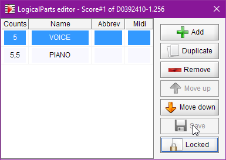
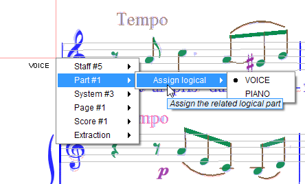

## Logical Parts
{: .no_toc }
{: .d-inline-block }
new in 5.3
{: .label .label-yellow }

Mapping the individual parts of every system in every page to logical parts defined at score level
is a topic where we may have to help the OMR engine.

---
Table of contents
{: .text-delta }

1. TOC
{:toc}
---

### Definition

A part is generally meant to represent a given music instrument.
It contains one stave, or two staves (piano example), or even 3 staves (organ).  
We refer to these parts as "*physical*" parts. 

A system is a vertical collection of parts, to be played in sync.  
The systems, all composed of (physical) parts, are played one after the other.

In many cases, one (physical) part in a system corresponds to another (physical) part in the 
following system(s). We refer to this logical sequence as a **logical** part, which represents
the same instrument all along the score.

### Parts mapping

In some cases, from one system to the next, the system composition in terms of physical parts may vary
as shown in the following example:

- System #1: A part made of 2 staves. This part is named "PIANO" in its left margin.
- System #2: A part made of 2 staves. No name is indicated but we can easily assume it's still the piano instrument.
- System #3: 2 parts:
    - A 1-staff part, with no name. The singer joining the party?
    - A 2-staff part, with no name. Still the piano.

So we come up with 2 logical parts: a (no name) singer part and a PIANO part.

The OMR engine is able to determine this easy mapping on its own, by collecting and organizing
each system part, one after the other.  
We call this action: "***Part collation***" (into logical parts).

Part collation is automatically triggered at the end of score transcription,
and before any export to MusicXML.  
We can also manually trigger parts collation.
This is done via a right-click in a score area, which opens a popup menu as follows:  

To visualize the current mapping, one easy way is to tick the item ``Show part names``
in the ``View`` pull-down menu.
This results in:

Each physical part is prefixed with the name of its corresponding logical part.
- System #1
    - PIANO (the existing "PIANO" text is displayed)
- System #2
    - PIANO (displayed in small size with a slight vertical offset)[^name_offset]
- System #3
    - (blank) since we have yet no name for this logical part
    - PIANO (displayed in small size with a slight vertical offset)

### Edition of logical parts

Still via a right-click in the score area, we can open an editor on logical parts:  

In our example, this editor will open as follows:

On the left side, we have a sequence of rows, one per logical part:
- **Staves**: The physical configuration of staves in part:  
    - A comma-separated sequence of numbers, one per staff in part, giving the staff line count.  
    - If the sheet contains two populations of staff height, the character **'s'**
    (for **s**mall) is appended when describing a **small** staff (for example: 5s).
- **Name**: The (logical) part name, or blank
- **Abbrev**: The related abbreviation if any
- **Midi**: The specified MIDI channel (left blank, reserved for future use)

The picture above presents the content of the logical parts editor,
automatically pre-populated by parts collation on our example.  
We can see that 2 logical parts have been detected:
1. Part #1 contains just one staff, of standard size, composed of 5 staff lines.  
No name has been detected for this part.
2. Part #2 is a sequence of 2 staves, each composed of 5 staff lines.  
The string "PIANO" has been detected as the part name.

All these fields are editable.

On the right side, we have a collection of buttons to add, duplicate or remove parts,
to move them up or down, and to save the logicals configuration.

For instance, we can decide to name the 1-staff part: "VOICE" to be consistent
with the existing "PIANO" name. That's all we need to do, so we save it:

Notice that the lower-right button (which was "*Unlocked*" in gray) is now "*Locked*" in black.  
This means that the logicals just saved are now locked (but can be manually unlocked if so desired).

Notice also that the main score window now displays the updated parts names:  

### Unlocked/Locked logicals configuration

The "Parts collation" action works differently according to the unlocked/locked status
of our logicals configuration.

In the **Unlocked** status, the logicals configuration is (re-)written from scratch.  
For each physical part found in sequence in the score:
1. The physical part name and characteristics are collected,
2. A compatible logical part is either reused or created,
3. The physical part is mapped to its logical part.

In the **Locked** status, the logicals configuration is in read-only mode.  
For each physical part -- not manually mapped -- found in sequence in the score:
1. The physical part name and characteristics are collected,
2. The physical part is assigned to a compatible logical part
or a warning is displayed for this un-mappable physical part.

### Mapping algorithm

The parts mapping works as follows.  
For every physical part checked against a logical part:
- Parts physical configurations must match
(number of staves, staff-line counts, staff small attribute if any).
- If a physical part name has been recognized or assigned, it is compared, ignoring case,
with logical name or logical abbreviation.
- If physical and logical do not match, check is made against the next logical if any.

Within every system, this part checking is performed as follows:
- If the system contains a standard 2-staff part (typically the piano part),
then checking goes bottom-up from the piano part,
and goes top-down for the parts located below the piano part.
- If there is no piano part, checking is done bottom-up.

### Manual mapping

If the score gets too complex for the OMR engine, we can always fall back
to the manual mapping of any "un-mappable" physical part.

This is done via a right-click in the physical part to be manually mapped:  

We simply have to pick up the corresponding logical among the presented sequence of logicals.

See a real-life example in [Can't Take My Eyes Off of You](../ui_examples/eyes/README.md#logical-parts)

[^name_offset]: Created part names are displayed slightly off of the expected vertical location, to avoid hiding any  potential existing part name.