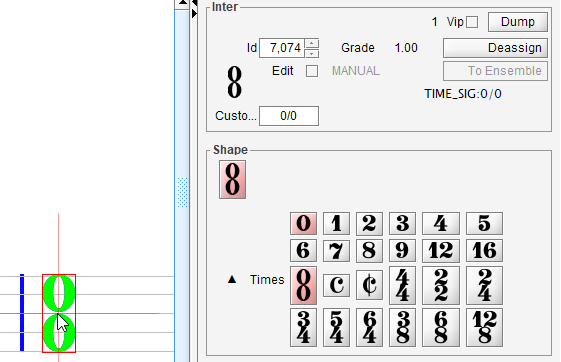
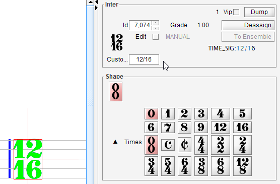

## Time Signature
{: .no_toc }

---
Table of contents
{: .text-delta }

1. TOC
{:toc}
---
### Whole vs Pair

Audiveris OMR is able to handle both whole- and pair- time signatures:

* A _whole_ time signature is a signature handled as a whole. It can be:

  1. A single musical symbol (COMMON_TIME and CUT_TIME)
  2. A predefined combo. As of today, these are 4/4, 2/2, 2/4, 3/4, 5/4, 6/4, 3/8, 6/8 and 12/8
  3. The _custom_ combo (initially set to 0/0)

* A _pair_ time signature is a signature handled as an ensemble of two separate time numbers.
Not all pairs can be recognized, only the equivalent forms of predefined combos (see above).

The OMR engine can automatically recognize whole and pairs, that is all the examples above except
the custom combo which is reserved for user manual definition.

For say a 2/4 time signature, the engine may recognize the "2" glyph and the "4" glyph leading
to a pair, and at the same time recognize the "2/4" compound glyph leading to a whole combo.  
The better grade will determine which interpretation will be kept.
In fact, the precise chosen interpretation has no impact on OMR processing.

### Predefined time signatures

If a time signature has not been detected or has been assigned a wrong value, we can select the
underlying glyph and assign the desired value, either via a double-click in the shape palette or
via the `Glyphs...` popup menu.
This works for the whole signature (or for each signature part, in the case of a pair signature).

We can also drag a chosen time signature from the shape palette and drop it at proper location,
but this feature is available only for a _whole_ signature, we cannot drag n' drop time parts
of a pair.

Moreover, in these two cases (glyph assignment and drag n' drop), please note that the choice is
_limited to the predefined shapes_ of the palette.

### Custom time signature

Since 5.2 release, the time shape palette provides a `custom` time signature.
This is a fully-customizable combo signature.

To define a precise time signature, the most convenient way is often to drag the `custom` combo
(0/0) from the shape palette to a target location:

Once dropped, the custom combo displays its initial value (`0/0`):

We can then use the inter board to enter the desired values for our custom combo, formatted as
"numerator / denominator".

We are **no longer limited** to the predefined time values.

The only constraint is that each numerator or denominator value must stay within [0..99] range
(0 being just a temporary value, of course).

### Location

We cannot resize a time signature, and its location is snapped on the containing staff.

A whole time signature can be shifted horizontally within its staff.

In the case of a pair of parts, each part can be (slightly) shifted horizontally.

{: .highlight }
Although in theory each staff of a containing  system should have its own time signature,
Audiveris can work with just one staff populated with a time signature.  
We thus don't have to repeatedly enter the same time signature on each and every staff of a
system.
